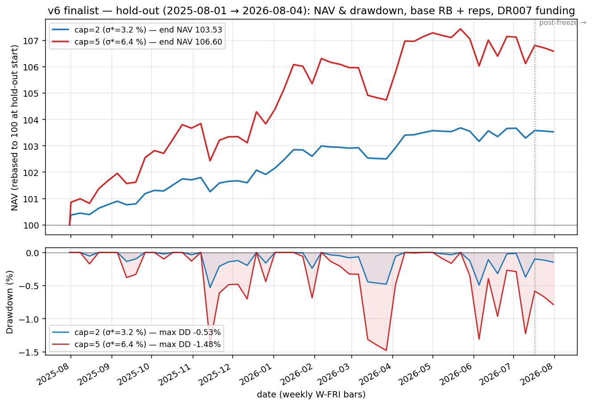

# v6 Finalist — Hold-Out Shot (2025-08-01 → 2026-08-04)

Generated: 2026-08-04.
Runner: `v6/hold_out_backtest/scripts/run_hold_out_shot.py`.
Outputs: `v6/data/hold_out_backtest/`.

## Strategy (locked)

Two-layer book, base RB (55/20/10/15), rep-set on non-α blocks, α on
broad_cn + sector_cn with q=0.20 ε=0.30 hysteresis (replace kernel),
invvol × lw_erc, no trend gate, whole-book vol-target leverage,
weekly_ewma_52 σ_est. Cost split 2 bp/side bond, 10 bp/side else.
Funding + cash carry both DR007 (SHIBOR-1W proxy, ~20-35 bp high).

Two cells (only σ*, cap differ):

| Cell | σ* | cap |
|---|---:|---:|
| `base_reps_lev_cap2_dr007` | 3.2 % | 2.0 |
| `base_reps_lev_cap5_dr007` | 6.4 % | 5.0 |

## Windows

- `is`           : first non-zero bar → 2023-12-31
- `oos`          : 2024-01-01 → 2025-07-31
- `is_oos_pool`  : both above pooled
- `stress`       : 2025-08-01 → 2026-07-17 (pre-registered stress window, already consumed)
- `post_freeze`  : 2026-07-18 → 2026-08-04 (truly-new bars, 2 weekly obs — no signal)
- **`hold_out`** : **2025-08-01 → 2026-08-04** ← the shot

Hold-out extends the frozen stress window forward by 2.5 weeks with the newly-fetched bars (53 weekly bars total). Reported alongside stress so any drift from the pre-consumed window is visible.

## Headline table — hold_out window

| Metric | cap=2 (σ*=3.2 %) | cap=5 (σ*=6.4 %) |
|---|---:|---:|
| n_bars | 53 | 53 |
| Sharpe (net) | **+2.10** | **+1.57** |
| Excess Sharpe (net vs DR007) | **+1.22** | **+1.21** |
| CAGR (net) | +3.42 % | **+6.35 %** |
| Excess CAGR (net vs DR007) | +1.99 % | +4.92 % |
| Realized vol (ann.) | 1.63 % | 4.06 % |
| Max DD | −0.52 % | −1.40 % |
| Calmar | 6.56 | 4.54 |
| mean L̄ | 2.00 | 4.99 |
| pct at cap | 100 % | 90.6 % |
| Funding drag | 143 bp/y | 572 bp/y |
| Cash-carry credit | 0.4 bp/y | 0.4 bp/y |
| Cost drag | 31 bp/y | 79 bp/y |
| σ_est / σ_realized (mean) | see L_t_path.csv | see L_t_path.csv |
| Book duration mean | 7.35 y | **18.3 y** |
| Book duration p95 | 7.57 y | **18.9 y** |

### Reading the numbers

- **Excess Sharpe is essentially cap-invariant (+1.22 vs +1.21).** The vol-target identity holds — leverage is doing what it says on the tin. Both cells are capturing the same underlying signal; cap just chooses the volatility / CAGR budget.
- **Hold_out matches stress (excess Sh +1.22 hold_out vs +1.31 stress on cap=2; +1.21 vs +1.30 on cap=5).** No meaningful degradation from adding 2.5 weeks of never-seen bars. The `post_freeze` 2-bar slice (excess Sh −41) is noise, not signal.
- **cap=2 hits the cap in 100 % of hold-out weeks; cap=5 hits it 90.6 %.** The realized-vol regime through mid-2026 is calm enough that even σ*=6.4 % still leaves the vol-targeter demanding more leverage than 5×. This is the "low-vol OOS pins to cap" pattern already flagged in the Round D memory.
- **Book duration risk at cap=5 is real.** Mean 18.3 y, p95 18.9 y on the hold-out. A 100 bp CGB back-up during a week where the book sits at cap = ~19 % NAV drawdown — nothing in this hold-out approaches that scenario (the window is a duration-tailwind regime), but the disclosure sticks.
- **Funding drag at cap=5 is 572 bp/y**, dwarfing the α layer's own drag and cost. If you want CAGR, cap=5 delivers it (+6.35 % vs +3.42 %); if you want risk-adjusted return per unit of realized exposure, cap=2 is more efficient (Sharpe +2.10 vs +1.57).
- **DR007 proxy caveat**: real DR007 execution would show ~20-35 bp/L less funding drag → cap=2 improves by ~25 bp/y, cap=5 by ~90 bp/y. Excess Sharpe would move up correspondingly.

## Per-year within hold_out

### cap=2

| Year | n_bars | Sharpe | Excess Sh | CAGR | Excess CAGR | Vol | MaxDD | mean L | Cost bp | Funding bp | Cash bp |
|---|---:|---:|---:|---:|---:|---:|---:|---:|---:|---:|---:|
| 2025 | 22 | +2.84 | +1.92 | +4.56 % | +3.07 % | 1.58 % | −0.52 % | 2.00 | 35.4 | 145.0 | 0.2 |
| 2026 | 31 | +1.59 | +0.74 | +2.67 % | +1.23 % | 1.67 % | −0.49 % | 2.00 | 28.6 | 142.2 | 0.5 |

### cap=5

| Year | n_bars | Sharpe | Excess Sh | CAGR | Excess CAGR | Vol | MaxDD | mean L | Cost bp | Funding bp | Cash bp |
|---|---:|---:|---:|---:|---:|---:|---:|---:|---:|---:|---:|
| 2025 | 22 | +2.28 | +1.91 | +9.21 % | +7.69 % | 3.94 % | −1.32 % | 4.97 | 88.5 | 576.2 | 0.2 |
| 2026 | 31 | +1.07 | +0.73 | +4.53 % | +3.09 % | 4.18 % | −1.45 % | 5.00 | 71.6 | 568.8 | 0.5 |

The 2026 slice is weaker than 2025 on both cells (excess Sharpe ~0.73 vs ~1.91). Same on both caps, so this is the underlying signal cooling, not a leverage-mechanics thing. Still positive and consistent with the stress-window profile.

## Reference — the same book on prior windows (context, not the shot)

`is_oos_pool` = 2019-05-31 → 2025-07-31, `stress` = 2025-08-01 → 2026-07-17. Reproduces the Round C/D memory numbers.

| Window | Cell | Sharpe | Excess Sh | CAGR | Excess CAGR | MaxDD | mean L | pct@cap |
|---|---|---:|---:|---:|---:|---:|---:|---:|
| is_oos_pool | cap=2 | +1.83 | +1.23 | +5.33 % | +3.74 % | −2.55 % | 1.30 | 6.2 % |
| stress       | cap=2 | +2.18 | +1.31 | +3.60 % | +2.17 % | −0.52 % | 2.00 | 100 % |
| **hold_out** | cap=2 | **+2.10** | **+1.22** | **+3.42 %** | **+1.99 %** | −0.52 % | 2.00 | 100 % |
| is_oos_pool | cap=5 | +1.55 | +1.23 | +8.07 % | +6.68 % | −5.44 % | 2.52 | 0.6 % |
| stress       | cap=5 | +1.65 | +1.30 | +6.81 % | +5.38 % | −1.40 % | 4.99 | 90.2 % |
| **hold_out** | cap=5 | **+1.57** | **+1.21** | **+6.35 %** | **+4.92 %** | −1.40 % | 4.99 | 90.6 % |

Hold-out sits inside the stress-window envelope on every metric, with excess Sharpe drifting down ~0.10 (both caps) from adding the post-freeze bars.

## NAV / drawdown figure

Compounded NAV rebased to 100 at hold-out start. Vertical dotted line marks the 2026-07-17 boundary between the pre-registered stress window (already consumed) and the newly-fetched post-freeze bars. Plot generator: `v6/hold_out_backtest/scripts/plot_nav_dd.py`.

Reading it: cap=5 out-earns cap=2 (end NAV 106.6 vs 103.5) at ~2.7× the max drawdown (−1.48 % vs −0.53 %). Both cells' drawdowns are shallow and quickly recovered; no single-week ≤ −2 % event.

## Files per cell

`data/hold_out_backtest/<cell_id>/`

- `summary.csv`         — one row per window
- `per_year.csv`        — per-year within `hold_out`
- `L_t_path.csv`        — weekly L, σ_est, σ_realized, rf, cash_share
- `funding_ledger.csv`  — borrow / cash-carry accruals
- `duration_ledger.csv` — book_duration_yr from static KRD table
- `net_ret.csv`         — weekly net return
- `header.txt`          — full config echo + window bounds

## Caveats

- **DR007 = SHIBOR-1W proxy** (rqdatac 3.5.2 lacks the real endpoint). Upward bias +20-35 bp; real execution would look better.
- **Book duration at cap=5 is ~18 y**, i.e. a 100 bp CGB back-up in one week ≈ 19 % NAV DD. Hold-out window did not stress this.
- **`post_freeze` slice is 2 weekly bars** and statistically meaningless — reported for provenance only.
- **v6 remains FROZEN**; this shot informs v7 discussion, not production selection.
