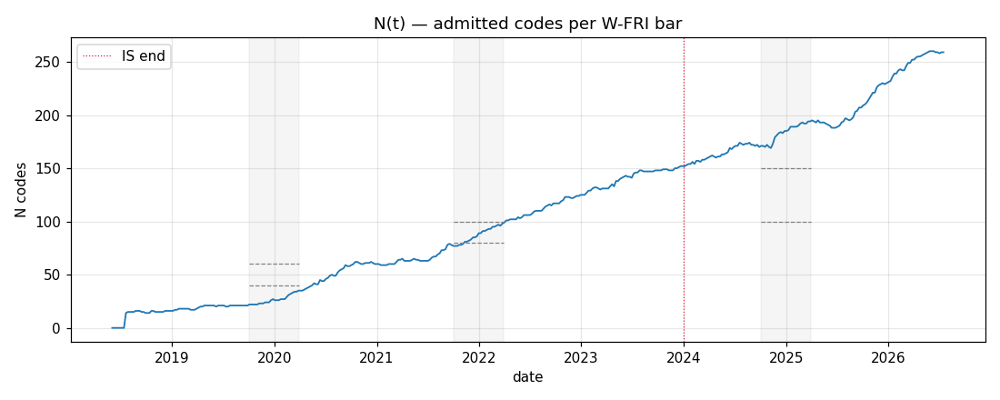
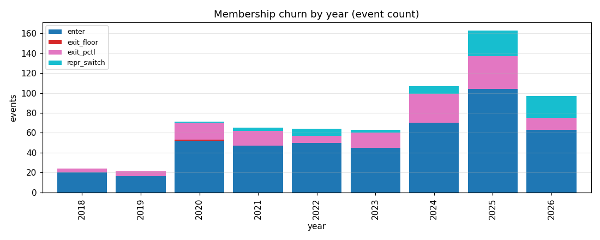
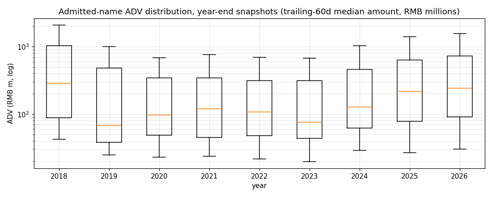

# `universe_v6` — MEMBERSHIP report (Phase 3.3)

Auto-generated by `v6/scripts/universe_v6_report.py`.

## Headline

- Weekly bars (W-FRI): **425**   (2018-06-01 → 2026-07-17)
- Catalogue size: **1703** ETFs (1688 with px data, 15 delisted before 2018-06-01 or list_date in future)
- Ever-admitted (`CODES_V6`): **344**
- N(t) min / median / max: **0 / 106 / 260**
- First bar with N ≥ 40: **2020-05-15**
- First bar with N ≥ 60: **2020-10-09**

## Frozen floors (post-Phase 3.4 review — see DESIGN §2.4 addendum)

- `SEASONING_BARS` = 26 weekly bars
- `ADV_FLOOR_ENTER` = ¥20,000,000   `ADV_FLOOR_EXIT` = ¥10,000,000
- `AUM_FLOOR_ENTER` = ¥200,000,000   `AUM_FLOOR_EXIT` = ¥100,000,000
- `ADV_PCTL_ENTER` = 0.2   `ADV_PCTL_EXIT` = 0.15
- `INDEX_DEDUP_ADV_MARGIN` = 0.25

## N(t) sanity check (pre-registered from DESIGN §2.5)

| target_date   | eval_bar   | target_N   |   actual_N | status   |
|:--------------|:-----------|:-----------|-----------:|:---------|
| 2019-12-31    | 2019-12-27 | 40–60      |         27 | MISS     |
| 2021-12-31    | 2021-12-31 | 80–100     |         89 | OK       |
| 2024-12-31    | 2024-12-27 | 100–150    |        185 | MISS     |

Sanity targets are calibration hints, not gates (§2.5). The 2019-12 target isn't met — the CN ETF market at that date genuinely had few tradable names outside the top ~30 indices. Recalibrating floors further to reach 40 admits marginal names in 2024+ (see §2.4 addendum for the decision trace).

## N(t) curve

Grey bands mark the ±90-day windows around the pre-registered sanity dates; dashed lines are the target [lo, hi] band. Red dotted vertical is the IS-end freeze at 2023-12-31.

## Churn per year

| event       |   count |
|:------------|--------:|
| enter       |     467 |
| exit_pctl   |     137 |
| repr_switch |      70 |
| exit_floor  |       1 |

## ADV distribution by year (admitted names, year-end)

## Block composition through time

*Deferred.* All catalogue rows are currently `UNTAGGED`. Per the resolved Open Decision D1 in `IMPLEMENTATION_PLAN.md`, block tagging happens **after** MEMBERSHIP is frozen and is scoped to the 344 ever-admitted codes only. Rerun this report after that pass to populate the block-composition chart.
