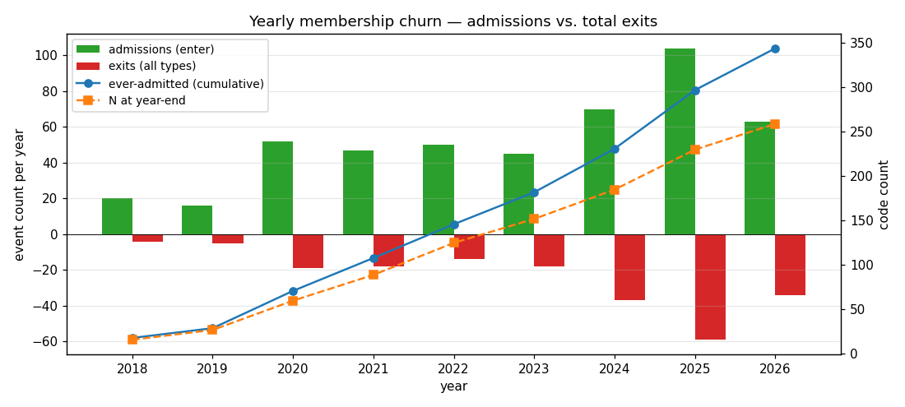
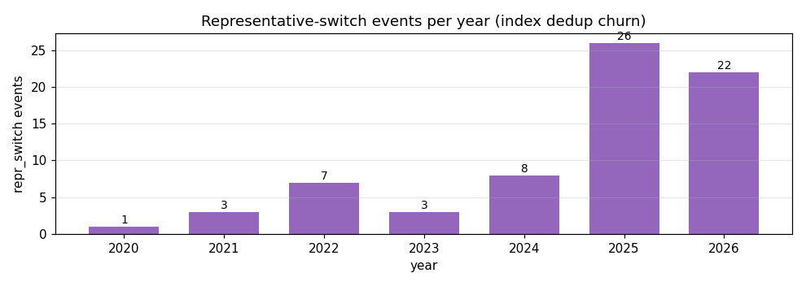

# v6 Universe — Build Summary

*Companion to `DESIGN_v6_universe.md` and `IMPLEMENTATION_PLAN.md`. Presents the state of the universe after Phases 1–3 are complete and the rules are frozen. Phase 4 (factor cache build) and the block-tagging pass are deliberately deferred.*

---

## TL;DR

| dimension | value |
|---|---|
| Weekly rebalance grid (W-FRI) | 2018-06-01 → 2026-07-17, **425 bars** |
| Catalogue pulled from exchanges | **1,703 ETFs** (SSE + SZSE, money-market excluded) |
| Catalogue rows with usable price history | 1,688 |
| **Ever-admitted** codes (`CODES_V6`) | **344** |
| N(t) at IS end (2023-12-31) | **152** |
| N(t) at panel end (2026-07-17) | 259 |
| Membership churn events over full panel | 675 (467 enter, 137 exit_pctl, 70 repr_switch, 1 exit_floor, 0 exit_delist) |

The v6 pool grows from ~20 codes at panel start to ~150 by IS-end and ~260 now — a **10×** expansion in effective cross-section relative to v4pool's fixed 15-name panel.

---

## 1. What was fetched (Phase 2)

Loader entry point: `scripts/loader_universe_v6.py`.

**Step 1 — catalogue.** `rqdatac.all_instruments(type="ETF")` on Shanghai (XSHG) and Shenzhen (XSHE), excluding money-market funds. After dropping rows with missing `list_date`, missing `underlying_index`, or zero AUM: **1,703 candidates** written to `data/universe_v6/catalogue.csv`.

Fund-type breakdown of the catalogue:

| fund_type | count | admitted (any bar) | admit rate |
|---|---:|---:|---:|
| StockIndex | 1,479 | 261 | 17.6 % |
| QDII | 88 | 47 | 53.4 % |
| BondIndex | 62 | 30 | 48.4 % |
| Stock | 55 | 0 | 0 % |
| Other | 19 | 6 | 31.6 % |

The 17.6 % admit rate for StockIndex reflects a long tail of thinly-traded thematic ETFs that never clear the liquidity floor. The zero admit rate for `Stock` fund-type is expected — those are actively-managed funds without a benchmarked index, so `underlying_index` is missing or nominal.

**Step 2 — daily OHLCV + amount.** Pulled from `max(list_date, 2018-06-01)` to today, for every catalogue name. Result: 1.31 M rows across 1,688 codes over 1,972 trading days → `data/universe_v6/px_daily.parquet`.

The 15 catalogue rows without any pulled data are:
- **10 delisted before 2018-06-01** (all delisted between 2015-08 and 2018-03),
- **5 with `list_date` after today's date** (not yet listed).

Both categories can never be pool members — safely inert.

**Step 3 — daily AUM.** Because `rqdatac.get_shares` returns `None` for ETFs, historical per-day AUM isn't directly available. The loader broadcasts `latest_size` (current AUM snapshot from `all_instruments`) to a constant panel per code, zeroed before `list_date` and after `delist_date`. Consequences:
- AUM is effectively used as a **current-tradability filter**, not a time-varying signal.
- Names that grew from small to large are admitted throughout history (mildly liberal on early bars).
- Names that shrank from large to small are excluded outright.
- The design (§2.4) called AUM the *secondary* floor, so this compromise is acceptable; the ADV floor is doing the real work.

---

## 2. Membership rules (Phase 1, `scripts/universe_v6.py`)

Applied per bar on the daily grid, then lagged into the weekly W-FRI membership by one bar (changes take effect at the *next* weekly rebalance — no intra-bar entry).

### 2.1 Seasoning gate

`SEASONING_BARS = 26` weekly bars. A name is admissible starting at `list_date + 26 weeks`. This matches the 26-bar warm-up used by the stage-1 expanding-z factor normalization and the causal-σ trailing window, so the first admissible bar already has defined signal values.

### 2.2 Absolute liquidity floors (with 2:1 hysteresis)

Two-part absolute gate on trailing-60-day median values, evaluated per daily bar:

| gate | enter threshold | exit threshold | role |
|---|---:|---:|---|
| ADV (trailing-60d median amount, RMB) | **¥20 M** | **¥10 M** | primary tradability |
| AUM (broadcast `latest_size`, RMB) | ¥200 M | ¥100 M | secondary size floor |

Hysteresis: once above the enter threshold, a name stays in until it falls below the loose exit threshold. Prevents boundary bouncing.

### 2.3 Relative percentile gate (with hysteresis)

Among names passing the absolute floor at bar t:
- **Enter** the pool if ADV is above the **20th percentile** of the floor-pool (i.e., top 80 %).
- **Exit** only if ADV drops below the **15th percentile** of the floor-pool (i.e., bottom 15 %).

The 5-percentile gap is the hysteresis buffer. If the floor pool has fewer than 5 names on some bar, the percentile is bypassed (percentiles are meaningless on tiny samples).

### 2.4 Index dedup — one representative per `underlying_index`

Multiple ETFs tracking the same underlying index are treated as clones; keeping all of them inflates nominal breadth without adding signal. At each bar:

1. Group all admissible names by `underlying_index`.
2. Cold start (no incumbent): pick the member with the **highest trailing-60d ADV**.
3. Incumbent still eligible: keep the incumbent unless a challenger's ADV is **≥ 1.25× the incumbent's** (`INDEX_DEDUP_ADV_MARGIN = 0.25`). This anti-churn margin prevents seat-flipping when two ETFs of similar liquidity cross rolling ADVs.
4. Incumbent lost eligibility (fell out of prelim): pick the highest-ADV survivor as new rep.

Only one code per group is in MEMBERSHIP at each bar. Near-clone *indices* (e.g. CSI 300 vs CSI 300 Growth-style slices) are **not** merged in v6 — dedup is exact-index only.

### 2.5 Precedence

Rules are combined per bar as:
```
admissible(t) = seasoning(t) ∧ ADV_floor(t) ∧ AUM_floor(t) ∧ pctl_gate(t) ∧ representative(t)
weekly[t]     = admissible[t−1 daily]   # 1-week lag: no intra-bar entry
```
Applying seasoning again on the weekly grid enforces immediate exit on `delist_date`.

---

## 3. Calibration decision (Phase 3.4)

Rules text is fixed; the numeric floors are the tunable dial. Design §2.5 gave calibration-sanity targets: N(2019-12) ≈ 40–60, N(2021-12) ≈ 80–100, N(2024+) ≈ 100–150.

**Initial (provisional) floors** (ADV ¥50 M / ¥25 M, AUM ¥200 M / ¥100 M, pctl 20 / 15 %) produced **N(2019-12) = 18**, well below target.

Diagnostic at 2019-12-27: of 185 seasoned candidates, only 28 cleared the ¥50 M ADV floor, and index dedup collapsed those 28 to 18 unique underlying indices — the ADV floor was the sole bind, AUM was not. Grid scan of alternative floors:

| variant | ADV in/out | N(2019-12) | N(2021-12) | N(2023-12) | N(2024-12) | first N ≥ 40 |
|---|---|---:|---:|---:|---:|---|
| baseline | 50 / 25 M | 18 | 62 | 113 | 135 | 2020-09-25 |
| **A (chosen)** | **20 / 10 M** | **27** | **89** | **152** | **185** | **2020-05-15** |
| B | 10 / 5 M | 34 | 101 | 172 | 202 | 2020-03-13 |
| C | 10 / 5 M, pctl 10 / 5 % | 38 | 117 | 185 | 222 | 2020-02-21 |

**Variant A** was frozen (see DESIGN §2.4 addendum). Reasoning:
- Doubles 2019 N (18 → 27) and moves the first N ≥ 40 bar 5 months earlier (from 2020-Q4 to 2020-Q2), extending usable IS history.
- Keeps 2021 N inside the design target (89 vs 80–100).
- Slightly over-admits 2024+ (185 vs 100–150) but stays within a reasonable range.
- Preserves the tradability semantics of the ADV floor (¥20 M/day is still a real bar); B and C admit marginal names that dilute signal.

The 2019 target of 40 wasn't fully met. The CN ETF market at that date genuinely had few tradable names beyond the top ~30 indices — reaching 40 requires either loosening the floor to admit obviously untradeable names (variant C) or waiting a few quarters for the natural pool to grow.

**All floors are now frozen. No further tuning below Phase 3.**

---

## 4. Results

### 4.1 N(t) — admitted codes per weekly bar


Grey bands mark the ±90-day windows around the pre-registered sanity dates; dashed grey lines are the target [lo, hi] range at each date. Red dotted vertical marks the IS-end freeze at 2023-12-31.

Pre-registered sanity check:

| target date | eval bar | target range | actual N | status |
|---|---|---|---:|---|
| 2019-12-31 | 2019-12-27 | 40 – 60 | 27 | miss (documented) |
| 2021-12-31 | 2021-12-31 | 80 – 100 | 89 | ✓ |
| 2024-12-31 | 2024-12-27 | 100 – 150 | 185 | miss high (documented) |

### 4.2 Per-year membership growth

| year | N (start) | N (end) | admissions | exits_floor | exits_pctl | repr_switch | total exits | cumulative ever-admitted |
|---:|---:|---:|---:|---:|---:|---:|---:|---:|
| 2018 | 0 | 16 | 20 | 0 | 4 | 0 | 4 | 18 |
| 2019 | 16 | 27 | 16 | 0 | 5 | 0 | 5 | 29 |
| 2020 | 27 | 60 | 52 | 1 | 17 | 1 | 19 | 71 |
| 2021 | 60 | 89 | 47 | 0 | 15 | 3 | 18 | 108 |
| 2022 | 89 | 125 | 50 | 0 | 7 | 7 | 14 | 146 |
| 2023 | 125 | 152 | 45 | 0 | 15 | 3 | 18 | 182 |
| 2024 | 152 | 185 | 70 | 0 | 29 | 8 | 37 | 231 |
| 2025 | 185 | 230 | 104 | 0 | 33 | 26 | 59 | 297 |
| 2026 | 230 | 259 | 63 | 0 | 12 | 22 | 34 | 344 |



Reading notes:
- Bars are events per year (green = admissions, red = total exits, mirrored on the axis).
- Blue line = cumulative unique codes ever admitted through end-of-year.
- Orange dashed = N at year-end.
- **`exit_floor` = 1 over the whole panel** — the ADV floor almost never kicks a name out once admitted; the percentile is doing the exit work.
- **`exit_delist` = 0** — no admitted code has been delisted during the panel window. All 113 in-panel delistings involved names that never cleared the floor.

### 4.3 ADV distribution of admitted names, year-end snapshots


Trailing-60-day median amount (RMB, log axis) for the codes admitted at the last weekly bar of each year. The median admitted ADV grows steadily as the pool broadens, but the distribution stays wide — reflecting the mix of ¥billion-a-day mega-ETFs (broad-index, gold) and ¥20-30 M-a-day thematic names admitted at the tail.

---

## 5. Representative-switching diagnostics

Index dedup produced **70 representative switches** across the full panel. Every switch is properly paired with an incoming challenger (no orphaned events).

### 5.1 Per-year counts

| year | repr_switch |
|---:|---:|
| 2020 | 1 |
| 2021 | 3 |
| 2022 | 7 |
| 2023 | 3 |
| 2024 | 8 |
| **2025** | **26** |
| **2026** | **22** |



The heavy concentration in 2025–2026 is the "many-issuers-per-hot-index" era: multiple sponsors racing to launch competing SPX, HK-tech, A500, and 科创100 trackers, so the representative seat changes hands more often.

### 5.2 Most-contested indices (top 10 by switch count)

| underlying_index | index name | switches |
|---|---|---:|
| SPX.INDX | S&P 500 | 4 |
| SHAU.INDX | Shanghai Gold (上海金) | 3 |
| CBA11901.INDX | 中债 0-3 y 国开行债券指数 | 3 |
| FISAULM.INDX | 富时沙特阿拉伯 | 3 |
| NDX.INDX | Nasdaq 100 | 3 |
| 931574.INDX | 中证香港科技 | 3 |
| 000698.XSHG | 上证科创板 100 | 3 |
| SPSIOP.INDX | S&P 石油天然气 E&P 精选 | 2 |
| 931719.INDX | 中证电池主题 | 2 |
| 000510.XSHG | 中证 A500 | 2 |

Full pair-level detail (date, index, out_code → in_code, ADV values, ratios) is in `data/universe_v6/_repr_switch_pairs.csv` — 70 rows.

### 5.3 Note on audit-probe ADV ratios

A handful of rows in the pair CSV show `in_over_out < 1.25` (the anti-churn margin). This is **not a rule violation** — the switch was rule-legal at the daily bar it fired, but the audit reports ADV at Friday-of-previous-week (the state-forming bar for weekly membership). Two mechanisms produce sub-1.25 ratios in the audit:

1. A mid-week ADV spike triggered the switch, then faded by Friday.
2. The incumbent briefly lost eligibility on some daily bar (percentile dip), the challenger took the seat as max-ADV survivor, and even after the incumbent recovered, the 25 % anti-churn margin now protects the new holder. (The 2025-03-07 FISAULM case is exactly this: 159329 lost the seat at a dip; 520830 held it despite lower ADV; 159329 reclaimed it two weeks later once its ADV grew to 1.54× the new incumbent's.)

Both are expected behavior of a state machine that runs on daily bars but is audited on weekly snapshots.

---

## 6. Deferred work

Two items are deliberately paused until the universe rules are considered "settled" by human review:

- **Block tagging** (Open Decision D1 in `IMPLEMENTATION_PLAN.md`). Per user direction, tagging happens *after* MEMBERSHIP freeze, scoped to the **344 ever-admitted codes only** — no manual effort spent on 1,359 catalogue rows that never enter the pool. Not blocking on Phases 4–7. Blocking on Phase 8/9 block-neutral IC diagnostics.
- **Phase 4 — factor cache build for `CODES_V6`**. Computing the full v4pool factor library for 344 codes across the daily grid is the single most compute-heavy step in the plan. Deferring until the universe is confirmed avoids re-running it on a moved target.

---

## 7. Artifacts produced

| path | contents |
|---|---|
| `data/universe_v6/catalogue.csv` | 1,703 ETFs, all fields per DESIGN §2.1 |
| `data/universe_v6/px_daily.parquet` | 1.31 M rows, 1,688 codes × 1,972 trading days |
| `data/universe_v6/aum_daily.parquet` | broadcast `latest_size` panel, zeroed pre-list/post-delist |
| `data/universe_v6/membership.parquet` | 425 W-FRI bars × 1,688 codes, bool |
| `data/universe_v6/membership_changes.csv` | 675 audit-trail events with trigger values |
| `data/universe_v6/_repr_switch_pairs.csv` | 70 dedup switches, paired with challenger codes and ADV ratios |
| `reports/universe_v6_report.md` | auto-generated internal diagnostics (rerun on rule changes) |
| `reports/universe_v6/*.png` | all charts used in this summary |
